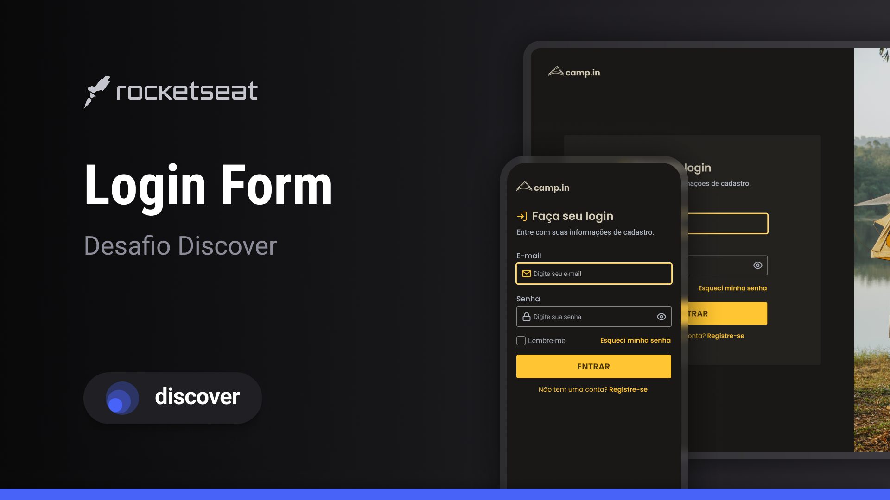

<h1 align="center">Title</h1>

   <h3> Desenvolvido na edição #00 do NLW. </h3>
    
A missão Origin do NLW#8 foi desenhada para quem está começando na programação.
 

   <a href="https://rocketseat.com.br">Rocketseat</a>.

  <h3>
    <a href="https://alrenp.github.io/foguetes/nlw/trilha%20explorer/08-doctorCare/">
      Project 
    </a>
    |
    <a href="https://efficient-sloth-d85.notion.site/Desafio-Login-Form-CSS-a10caea5a183494e97eb9ce4f33536b3">
      Challange
    </a>
    |
    <a href="https://www.figma.com/community/file/1241116056018043491/login-form-desafio-discover">
      Layout
    </a>
  </h3>

## Table of Contents

- [Overview](#overview)
- [Built With](#built-with)
- [Features](#features)
- [Contact](#contact)

## Overview

### Built With
- html
- css
- js
## Features
  

    
  

## Contact

- GitHub [@AlRenp](https://github.com/alrenp)
