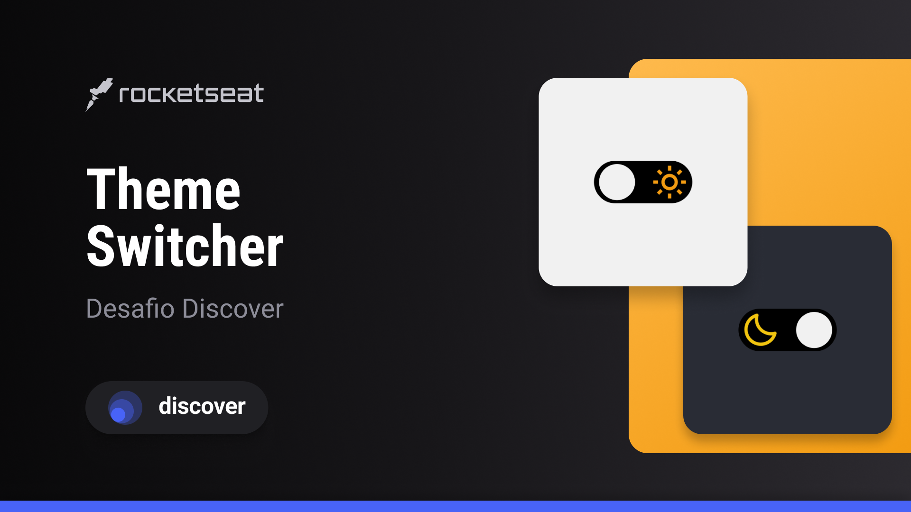

<h1 align="center">Switcher</h1>

    
 Nesse desafio foi desenvolvido uma página que com um SWITCHER  para alternar entre o tema dark e light.
 

  <h3>
    <a href="https://alrenp.github.io/foguetes/Discover/challanges/switcher/">
      Project 
    </a>
    |
    <a href="https://efficient-sloth-d85.notion.site/Desafio-Theme-Switcher-dbabdf77f70d43298df382c8e805fc13">
      Challange
    </a>
    |
    <a href="https://www.figma.com/community/file/1241117469370182245">
      Layout
    </a>
  </h3>

 <a href="https://rocketseat.com.br" >Rocketseat</a>

## Overview

### Built With
- html
- css
- js

## Contact

- Lnkedin [Alysson Renan](https://www.linkedin.com/in/alyssonrenan/)
