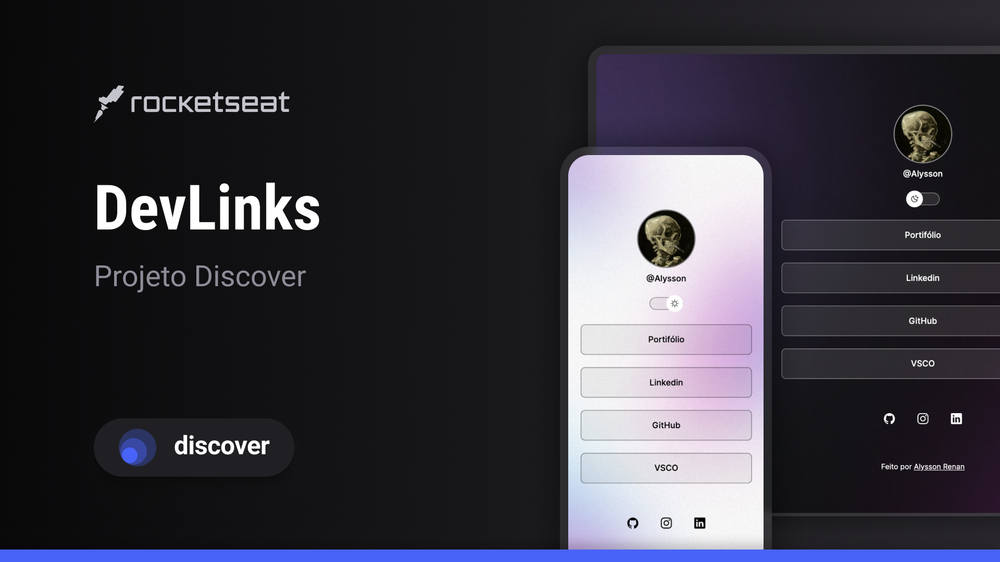

<h1 align="center">devLinks</h1>

  <h3>
    <a href="https://alrenp.github.io/foguetes/Discover/social-media/" target="_blank">
      Project
    </a>
     | 
    <a href="https://github.com/AlRenp/foguetes/tree/main/Discover/social-media" target="_blank">
      Solution
    </a>
     | 
    <a href="https://www.figma.com/community/file/1187422022288947321">
      Layout
    </a>
  </h3>

<!-- TABLE OF CONTENTS -->

## Table of Contents

- [Overview](#overview)
- [Built With](#built-with)
- [Features](#features)
- [Contact](#contact)

<!-- OVERVIEW -->

## Overview

### Built With

<!-- This section should list any major frameworks that you built your project using. Here are a few examples.-->

- html
- css
- js

## Features

<!-- List the features of your application or follow the template. Don't share the figma file here :) -->

Uma página <i>Social-linking</i> com recurso responsível.  Projeto desenvolvido junto com aulas didáticas do            <a href="https://github.com/maykbrito">Mayk Brito</a> na plataforma da <a href="https://rocketseat.com.br">Rocketseat</a>.

## Contact

<!-- - Website [your-website.com](https://{your-web-site-link}) -->

- GitHub: [@Alysson](https://github.com/alrenp)
- Instagram: [@4ysson](https://instagram.com/4ysson)
