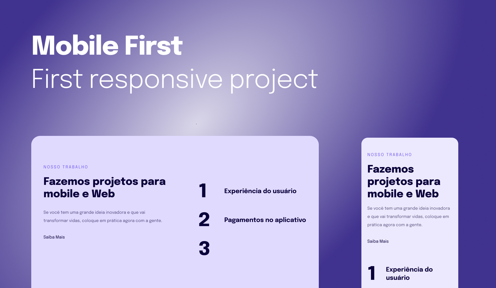

# Mobile First

> Projeito feito em aula

### Sobre o desafio

- Simples página para introdução de Media Queries

## Porjeto em Aula - [View Project](https://alrenp.github.io/foguetes/Explorer/classes/stage03/class02/)

 

> 

> Design - [Figma](<https://www.figma.com/file/HQhvUx6M24hXZYJTQyKmjp/Explorer-Stage-03-Projeto-02-(Copy)?type=design&node-id=203-412&mode=design&t=7yfUb1OWHUp8iCBb-0>)

### Tech

- html
- css
- git
- github

by: 
 <a href="https://www.instagram.com/4ysson/"> 
  @4ysson
 </a>

