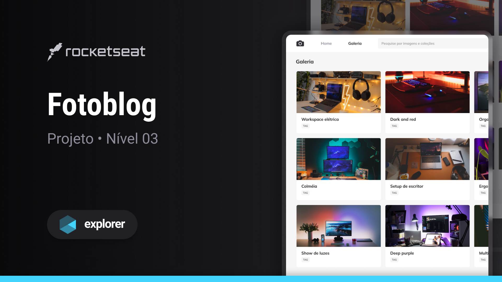

<!-- Please update value in the {}  -->

<h1 align="center">FotoBlog</h1>

   Solições desenvolidas junto às aulas de <a href="http://rocketseat.com.br" target="_blank">Rocketseat</a>.

  <h3>
    <a href="https://alrenp.github.io/foguetes/Explorer/classes/stage03/class05/" target="_blank">
      Project
    </a>
     | 
    <a href="https://github.com/AlRenp/foguetes/tree/main/Explorer/classes/stage03/class05" target="_blank">
      Solution
    </a>
     | 
    <a href="https://www.figma.com/community/file/1256354844988182987">
      Layout
    </a>
  </h3>

<!-- TABLE OF CONTENTS -->

## Table of Contents

- [Overview](#overview)
  - [Built With](#built-with)
- [Features](#features)
- [Contact](#contact)

<!-- OVERVIEW -->

## Overview

### Built With

<!-- This section should list any major frameworks that you built your project using. Here are a few examples.-->

- html
- css

## Features

<!-- List the features of your application or follow the template. Don't share the figma file here :) -->

Esse projeto foi feito utilizando a ferramenta GRID e com alguns recursos de animações e transições.

## Contact

<!-- - Website [your-website.com](https://{your-web-site-link}) -->

- GitHub: [@Alysson](https://github.com/alrenp)
- Instagram: [@4ysson](https://instagram.com/4ysson)
