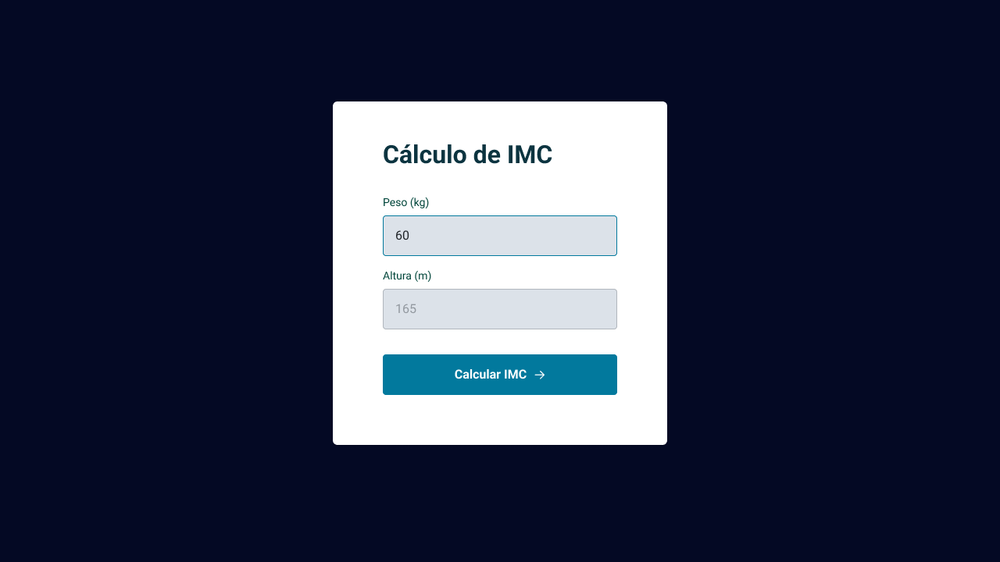

<h1 align="center">IMC</h1>

    Projeto desenvolvido durante aulas didáticas do <a href="https://github.com/maykbrito"> Mayk Brito </a> na plataforma no curso da <a href="https://rocketseat.com.br">Rocketseat</a>.

  <h3>
    <a href="https://alrenp.github.io/foguetes/Explorer/classes/stage05/02-calc-imc" target="_blank">
      Project
    </a>
     | 
    <a href="https://github.com/AlRenp/foguetes/tree/main/Explorer/classes/stage05/02-calc-imc" target="_blank">
      Solution
    </a>
     | 
    <a href="https://www.figma.com/file/1zf9wYwlAIdGXfFnIoWrda/IMC-(Copy)?type=design&node-id=6-5&mode=design&t=KMDEl1eMt9aMAUs6-0">
      Layout
    </a>
  </h3>

<!-- TABLE OF CONTENTS -->

## Table of Contents

- [Overview](#overview)
- [Built With](#built-with)
- [Features](#features)
- [Contact](#contact)

<!-- OVERVIEW -->

## Overview

### Built With

<!-- This section should list any major frameworks that you built your project using. Here are a few examples.-->

- html
- css
- js

## Features

<!-- List the features of your application or follow the template. Don't share the figma file here :) -->

    Este projeto é um simples calculador de IMC, aplicando um conceito de modularição para organização e compreenção do código.

      ✅ Modularização
      ✅ Exports e Imports

## Contact

<!-- - Website [your-website.com](https://{your-web-site-link}) -->

- GitHub: [@Alysson](https://github.com/alrenp)
- Instagram: [@4ysson](https://instagram.com/4ysson)