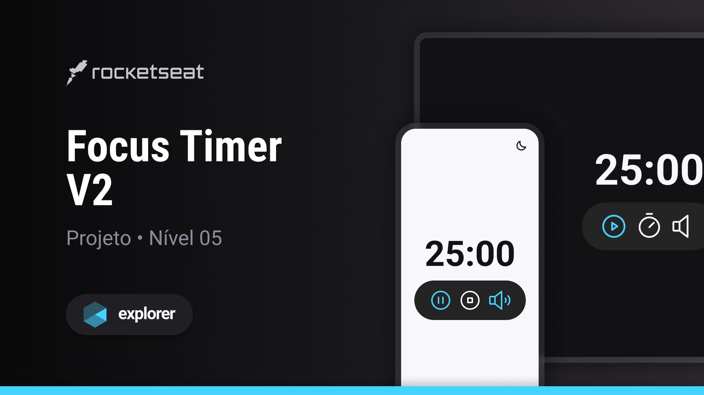

<h1 align="center">FocusTimer</h1>

   <h3>Projeto desenvolvido em aula </h3>

   <a href="https://rocketseat.com.br">Rocketseat</a>

  <h3>
    <a href="https://alrenp.github.io/foguetes/Explorer/classes/stage05/03-focus-timer">
      Project 
    </a>
    |
    <a href="https://github.com/AlRenp/foguetes/tree/main/Explorer/classes/stage05/03-focus-timer">
      Soluction
    </a>
    |
    <a href="https://www.figma.com/community/file/1263574581735209131/focus-timer-v2-projeto-explorer">
      Layout
    </a>
  </h3>

## Table of Contents

- [Overview](#overview)
- [Built With](#built-with)
- [Features](#features)
- [Contact](#contact)

## Overview

### Built With
- html
- css
- js
## Features
  

    O FocusTumer é um Timer desenvolvido em Javascript com possibilidade de alternar entre dark/light mode e música de fundo.  
    Com a utilização de módulos ES6, que nos ajudam a organizar o código de maneira modular e reutilizáve.
  

  

    Algumas funcionalidades do porjeto:

      - Tema dark e light
      - Efeitos sonoros
      - callback functions
      - Conceito de Estado
  

## Contact

- GitHub [@AlRenp](https://github.com/alrenp)
- Linkedin [@Alysson](https://www.linkedin.com/in/alyssonrenan/)
