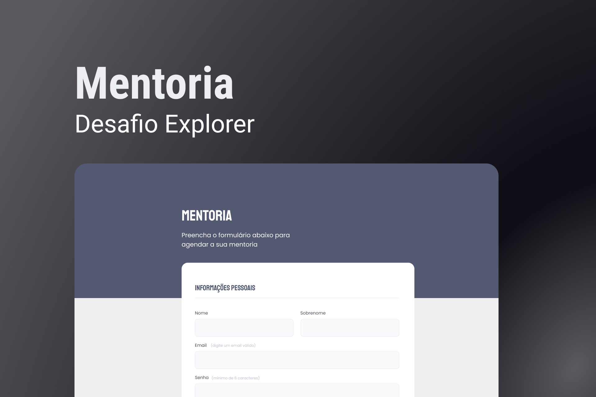

# Mentoria

> Esse projeto é um desafio proposto no módulo 3 do curso Explorer da Rocketseat

### Sobre o desafio

- Simples página para simular agenda de uma Mentoria
  > - Utilização de pseudo-elemento para criar um background no header
  > - Criação e estilização de um formulário com input e labels (type: text, time, date)

## Desafio stage 03 - [View Project](https://alrenp.github.io/Explorer/projects/stage03/01-mentoria)

 

> 

> Design - [Figma](https://www.figma.com/file/Nws1KWB7DyXBw8L6wXb9mp/Stage-03---Formul%C3%A1rio-intermedi%C3%A1rio?type=design&node-id=0-1&mode=design&t=CWvelMMz04lFnCXS-0)

### Tech

- html
- css

by: 
 <a href="https://www.instagram.com/4ysson/"> 
  @4ysson
 </a>

