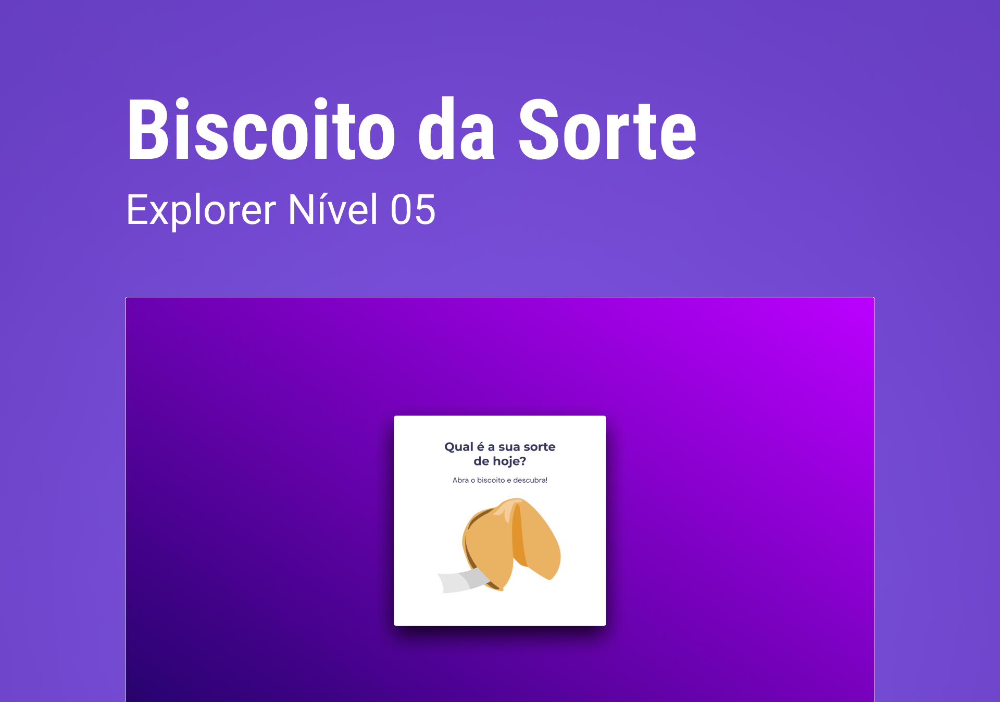

<h1 align="center">Biscoito da Sorte</h1>

    Desafio proposto no primeiro módulo do stage 05. 
    Desafio por <a href="https://rocketseat.com.br">Rocketseat</a>.

  <h3>
    <a href="https://alrenp.github.io/foguetes/Explorer/projects/stage05/01-biscoitdo-da-sorte/" target="_blank">
      Project
    </a>
     | 
    <a href="https://github.com/AlRenp/foguetes/tree/main/Explorer/projects/stage05/01-biscoitdo-da-sorte" target="_blank">
      Solution
    </a>
     | 
    <a href="https://www.figma.com/community/file/1182751789348533739">
      Layout
    </a>
     | 
    <a href="https://efficient-sloth-d85.notion.site/Biscoito-da-Sorte-3ec5cf82a6dc41eb9672f21351a309b8">
      Challenge
    </a>
  </h3>

<!-- TABLE OF CONTENTS -->

## Table of Contents

- [Overview](#overview)
- [Built With](#built-with)
- [Features](#features)
- [Contact](#contact)

<!-- OVERVIEW -->

## Overview

### Built With

<!-- This section should list any major frameworks that you built your project using. Here are a few examples.-->

- html
- css
- js

## Features

<!-- List the features of your application or follow the template. Don't share the figma file here :) -->

    Biscoito da Sorte, no qual o usuário, a partir de um clique ou enter, abre um biscoito com a sua sorte do dia.
    
        ✅ Estrutura de dados HTML  
        ✅ Animações com CSS 
        ✅ Funções no Javascript 
        ✅ Manipulação da DOM 
        ✅ Funções *callback* 
        ✅ Biblioteca JS Math() 
        ✅ Arrays 

## Contact

<!-- - Website [your-website.com](https://{your-web-site-link}) -->

- GitHub: [@Alysson](https://github.com/alrenp)
- Instagram: [@4ysson](https://instagram.com/4ysson)
