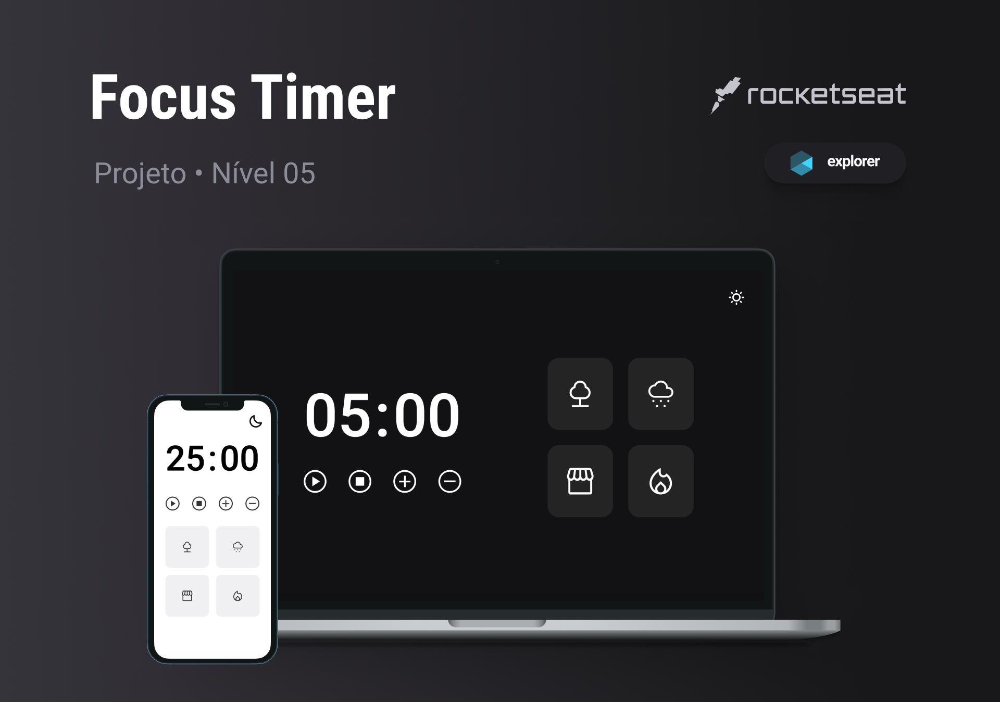

<h1 align="center">Title</h1>

    Desafio proposto no terceiro módulo do stage 05.   
    Desafio por <a href="https://rocketseat.com.br">Rocketseat</a>.

  <h3>
    <a href="https://alrenp.github.io//foguetes/tree/main/Explorer/projects/stage05/02-focus-timer">
      Project 
    </a>
    |
    <a href="https://efficient-sloth-d85.notion.site/FocusTimer-Vers-o-2-0-2e273fa9212a432eae6b51dda3c69594">
      Challange
    </a>
    |
    <a href="https://www.figma.com/file/asI4Wjrz9ECSD2qqMOROS4/Stage-05---Focus-Timer-2.0-(Copy)?type=design&node-id=0-1&mode=design&t=kjnxShOgvrLIgjlW-0">
      Layout
    </a>
  </h3>

## Table of Contents

- [Overview](#overview)
- [Built With](#built-with)
- [Features](#features)
- [Contact](#contact)

## Overview

### Built With
- html
- css
- js
## Features
  

    O FocusTumer é um Timer desenvolvido em Javascript com possibilidade de alternar entre dark/light mode e música de fundo.
    Com a utilização de módulos ES6, que nos ajudam a organizar o código de maneira modular e reutilizáve.
  
  

Algumas funcionalidades do porjeto:

  - Tema dark e light
  - Efeitos sonoros
  - callback functions
  - Conceito de Estado
  

## Contact

- GitHub [@AlRenp](https://github.com/alrenp)
- Linkedin [@Alysson](https://www.linkedin.com/in/alyssonrenan/)
