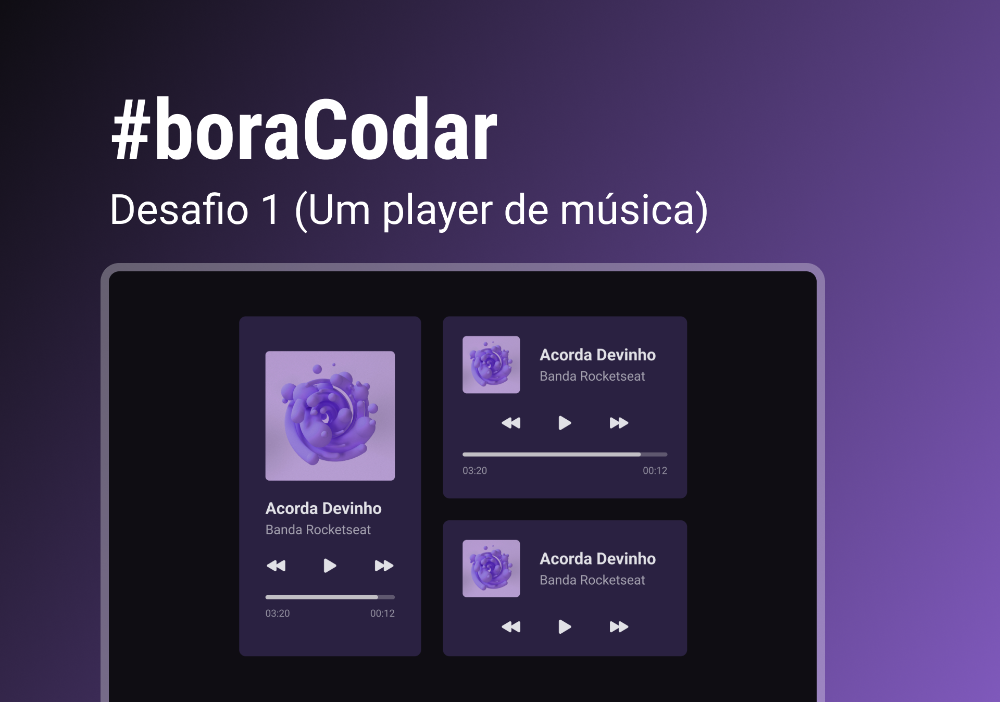

<h1 align="center">Title</h1>

    <h3> Desenvolvido durante o evendo <i> <u> #boraCodar </u> </i>  </h3> 
    
 Desafio por <a href="https://rocketseat.com.br">Rocketseat</a>. 

  <h3>
    <a href="https://alrenp.github.io/foguetes/boraCodar/01-music-player/" target="_blank">
      Project
    </a>
     | 
    <a href="https://github.com/AlRenp/foguetes/tree/main/boraCodar/01-music-player" target="_blank">
      Solution
    </a>
     | 
    <a href="https://www.figma.com/file/J3fvsbVBzqq7DNgj99RpRZ/%23boraCodar">
      Layout
    </a>
  </h3>

<!-- TABLE OF CONTENTS -->

## Table of Contents

- [Overview](#overview)
- [Built With](#built-with)
- [Features](#features)
- [Contact](#contact)

<!-- OVERVIEW -->

## Overview

### Built With

<!-- This section should list any major frameworks that you built your project using. Here are a few examples.-->

- html
- css

## Features

<!-- List the features of your application or follow the template. Don't share the figma file here :) -->

    Layout de uma Player de Música.

    ✅ Grid 
    ✅ Animações
    ✅ Display Mobile

## Contact

<!-- - Website [your-website.com](https://{your-web-site-link}) -->

- GitHub: [@Alysson](https://github.com/alrenp)
- Instagram: [@4ysson](https://instagram.com/4ysson)