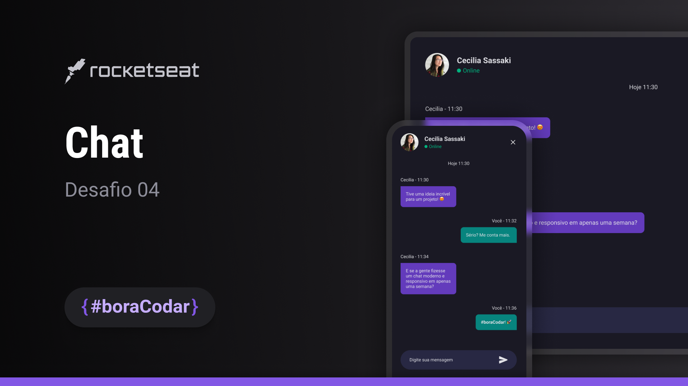

<h1 align="center">Title</h1>

    <h3> Desenvolvido durante o evendo <i> <u> #boraCodar </u> </i>  </h3> 
    
 Desafio por <a href="https://rocketseat.com.br">Rocketseat</a>. 

  <h3>
    <a href="https://alrenp.github.io/foguetes/nlw/trilha%20explorer/08-doctorCare/">
      Project 
    </a>
    |
    <a href="https://www.rocketseat.com.br/boracodar/desafios-anteriores/um-chat-desafio-04">
      Challange
    </a>
    |
    <a href="https://www.figma.com/community/file/1102912263666619803/DoctorCare">
      Layout
    </a>
  </h3>

## Table of Contents

- [Overview](#overview)
- [Built With](#built-with)
- [Features](#features)
- [Contact](#contact)

## Overview

### Built With
- html
- css

## Contact

- Linkedin [@Alysson Renan](https://www.linkedin.com/in/alyssonrenan/)
