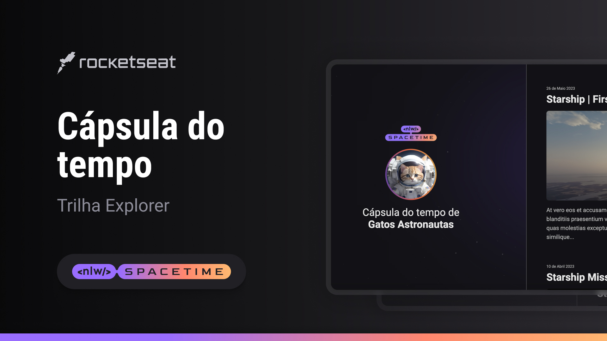

<h1 align="center">Spacetime</h1>

   Desenvolvio na edição #12 do NLW.  
   <a href="https://rocketseat.com.br">Rocketseat</a>

  <h3>
    <a href="https://alrenp.github.io/foguetes/nlw/trilha%20explorer/01-spacetiming/">
      Project 
    </a>
    |
    <a href="https://github.com/AlRenp/foguetes/tree/main/nlw/trilha%20explorer/01-spacetiming">
      Soluction
    </a>
    |
    <a href="https://www.figma.com/community/file/1240071097028170811/capsula-do-tempo-trilha-explorer">
      Layout
    </a>
  </h3>

## Table of Contents

- [Overview](#overview)
- [Built With](#built-with)
- [Features](#features)
- [Contact](#contact)

## Overview

### Built With
- html
- css

## Features
Esse projeto foi desenvolvido ao decorrer do evento NLW Spacetime de edição #12 na plataforma da 
<a href="https://rocketseat.com.br">Rocketseat</a>.
Uma simples página onde ficam listado links para alguns conteúdos da spaceX.

## Contact

- GitHub [@AlRenp](https://github.com/alrenp)
