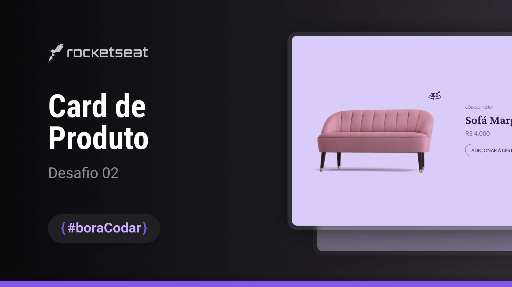

<h1 align="center">Product Card</h1>

    <h3> Desenvolvido durante o evendo <i> <u> #boraCodar </u> </i>  </h3> 
    
 Desafio por <a href="https://rocketseat.com.br">Rocketseat</a>. 

  <h3>
    <a href="https://alrenp.github.io/foguetes/nlw/trilha%20explorer/02-product-card/">
      Project 
    </a>
    |
    <a href="https://github.com/AlRenp/foguetes/tree/main/boraCodar/02-product-card" target="_blank">
      Soluction
    </a>
    |
    <a href="https://www.figma.com/community/file/1195050984449538256">
      Layout
    </a>
  </h3>

## Table of Contents

- [Overview](#overview)
- [Built With](#built-with)
- [Features](#features)
- [Contact](#contact)

## Overview

### Built With
- html
- css
- js

## Features
  

    O card de produto é um componente para visualizar os detalhes de um produto à venda. Ele foi desenhado para ser utilizado em aplicações web.  
    Esse desafio foi criado para o #boracodar, um projeto da Rocketseat com desafios semanais para você praticar desenvolvendo como achar melhor e evoluir seu código para o próximo nível.
  

    
## Contact

- GitHub: [@AlRenp](https://github.com/alrenp)
- Linkedin: [Alysson](https://linkedin.com/in/alyssonrenan/)
