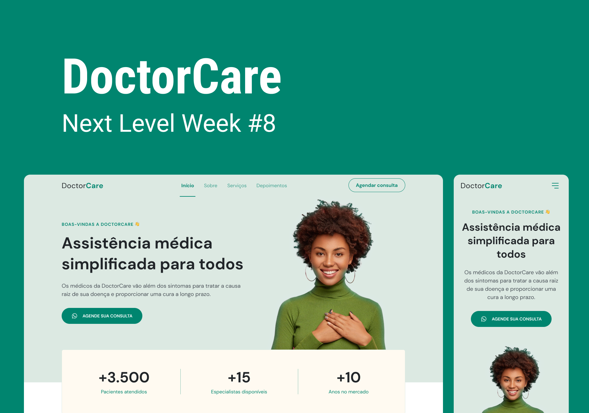

<h1 align="center">DoctorCare</h1>

   <h3> Desenvolvido na edição #08 do NLW. </h3>
    
A missão Origin do NLW#8 foi desenhada para quem está começando na programação.
 

   <a href="https://rocketseat.com.br">Rocketseat</a>.

  <h3>
    <a href="https://alrenp.github.io/foguetes/nlw/trilha%20explorer/08-doctorCare/">
      Project 
    </a>
    |
    <a href="https://github.com/AlRenp/foguetes/tree/main/nlw/trilha%20explorer/08-doctorCare">
      Soluction
    </a>
    |
    <a href="https://www.figma.com/community/file/1102912263666619803/DoctorCare">
      Layout
    </a>
  </h3>

## Table of Contents

- [Overview](#overview)
- [Built With](#built-with)
- [Features](#features)
- [Contact](#contact)

## Overview

### Built With
- html
- css
- js
## Features
  

    Nesse projeto foi desenvolvido uma página institucional no formato One Page, responsiva. O layout foi desenvolvido para a plataforma de consultas médicas DoctorCare.  
    Como o design é bem flexível, ele pode ser adaptado para diversos tipos de micro, pequenas e médias empresas, alterando apenas algumas propriedade.
  

    
    Algumas funcionálidades da página:

      ✅ Página responsiva
      ✅ Menu fixo no topo da página
      ✅ Scroll suave durante a navegação 
      ✅ Layout Grid para organizar seções
      ✅ Marcar a seção atual com js

## Contact

- GitHub [@AlRenp](https://github.com/alrenp)
